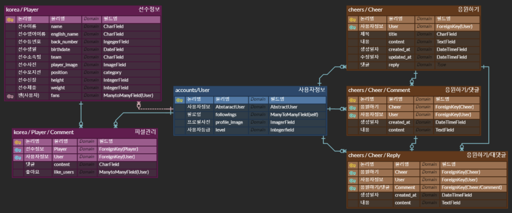
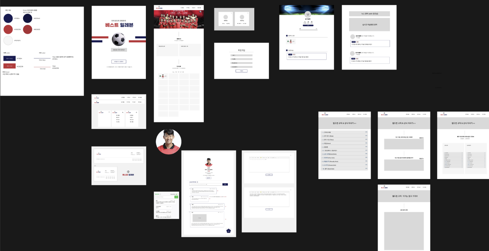

# 🗂️ Final Project 

> 서비스 이름 : 베스트일레븐(BEST ELEVEN)
>
> 서비스 소개 : 월드컵 국가대표 정보를 공유하는 커뮤니티
>
> 제작 기간 : 2022-11-24 ~ 2022-12-14
>
> 팀 구성 : 11팀 BEST ELEVEN / 간정진, [이수경](https://github.com/code-sum), 임선주, 주세환, 차화영
>
> ---
>
> < Contents >
>
> [1. 프로젝트 개요](#1-프로젝트-개요)
>
> [2. 프로젝트 기획](#2-프로젝트-기획)
>
> [3. 프로젝트 설계](#3-프로젝트-설계)
>
> [4. 기능 구현](#4-기능-구현)
>
> [5. 성과](#5-성과)
>
> ---

## 1. 프로젝트 개요

#### 1-1. 요구사항 명세

> 아래 조건을 만족하는 회원제 커뮤니티 서비스 개발

- **CRUD** 구현
- **Staticfiles** 활용 정적 파일(images, CSS, JS) 다루기
- **Django Auth** 활용 회원 관리 구현
- **Media** 활용 동적 파일 다루기
- 모델간 **1 : N** 관계 매핑 코드 작성 및 활용
  - 유저 - 리뷰
  - 유저 - 댓글
  - 리뷰 - 댓글

#### 1-2. 기대 효과

>  월드컵 국가대표 정보를 공유하는 커뮤니티 제작

- 유사 서비스 분석
  - 기존 축구 사이트들은 해외/국내 혹은 구단 단위로 게시판이 나뉘어 있음
  - 기존 커뮤니티 게시판이나 위키 서비스들은 글 작성자의 신뢰도 수준 등을 확인하기 어려움

- 평소 축구를 잘 몰랐던 사용자일지라도 2022 카타르 월드컵만큼은 축구 매니아들과 함께 즐길 수 있는 생태계 조성
- 국가대표 선수들의 플레이 스타일, 과거 이력, 개인기 등 사용자들이 직접 작성한 정보(=피셜)로 구성되어 있기에 방문자들은 친한 친구에게 이야기를 듣는 것처럼 친근함을 느낄 수 있고, 피셜 <좋아요>, <신고하기> 기능을 덧붙여 정보의 신뢰성도 추구함
- K리그에서 활동하는 국가대표 선수들에 대한 간접 홍보효과

#### 1-3. 역할 분담

- [**이수경**](https://github.com/code-sum) Frontend / 팀장
  - 프로젝트 베이스 코드 작성
  - Notion, Github Projects 활용하여 프로젝트 진행 총괄
  - 서비스 프론트엔드 기능 가운데 50% 설계(Figma) 및 구현
  - AWS 와 GitHub Actions 를 이용한 CI/CD 배포 업무 전담
- **주세환** Backend
- **차화영** Backend
- **임선주** Frontend 
- **간정진** Backend

## 2. 프로젝트 기획

#### 2-1. 핵심 기능

- 서비스 메인화면 
  - <응원하기 랭킹> 기능 구현 (응원하기 많이 받은 선수 TOP 11 캐러셀)
  - <국가대표 선수 목록> 기능 구현 (FW, MF, DF, GK 포지션별 분할 탭)
- 선수 개인 페이지 
  - 플레이 스타일, 과거 이력, 개인기 정보(=피셜)를 사용자가 직접 작성도록 기능 구현  (Summernote 활용)
  - <선수 응원하기>, <피셜 좋아요>, <피셜 신고하기> 기능 구현
- 피셜피드 
  - <실시간 월드컵 뉴스> 기능 구현 (BeautifulSoup 크롤링 활용) 
  - <지금 뜨는 피셜랭킹> 기능 구현 (좋아요 많이 받은 게시글 TOP 5 캐러셀)
  - <피셜 피드> 기능 구현 (사용자가 팔로우하는 타 사용자의 게시글 모아보기)
- 경기일정 : 2022 카타르 월드컵 경기일정을 확인할 수 있는 캘린더 
- 축구규칙 : 간략하게 정리한 축구 경기 규칙들
- 미니게임 : 1인용, 2인용 축구게임 기능 구현
- 이 밖에도 <사용자 간 팔로우>, <사용자 활동지수(EXP)>, <내가 응원하는 선수>, <내가 쓴 피셜> 등 추가 기능 구현

#### 2-2. 개발 환경

                  

- Programming Language : Python
- Script Language (Client) : JavaScript (ES6+)
- Framework : Django (3.2.13)
- Library / Package : Bootstrap (5.2.2), jQuery (3.6.1), Summernote, BeautifulSoup 4
- Web : HTML 5, CSS 3
- SCM : Git
- DB : PostgreSQL, SQLite 3
- Deploy : AWS S3/RDS/EC2, Github Actions
- IDE : Visual Studio Code
- Tools : Github, Notion, .ENV

#### 2-3. 일정 관리

- 11/27 : 프로젝트 베이스 코드 작성 
- 11/28 : 주제 사전 조사, DB 모델링, 기능&화면 설계 
- 11/29 ~ 12/2 : 베타 서비스 개발, 서비스 배포 
- 12/2 ~ 12/4 : 베타 서비스 이용후기 수집 
- 12/5 : 피드백 기반 중간점검 회의, 프로젝트 진행방향 설계 
- 12/5 ~ 12/14 : 프로젝트 개발 
- 12/15 : 프로젝트 발표

## 3. 프로젝트 설계

#### 3-1. DB 설계 (E-R 다이어그램)

#### 3-2. 화면 설계 (Figma)

## 4. 기능 구현

- 서비스 메인화면 
- 선수 개인 페이지 
- 피셜피드 
- 경기일정
- 축구규칙
- 미니게임

## 5. 성과

- **간정진** : 마지막 프로젝트인만큼 기간도 길고 다시 새로운 팀원들과 기획부터 개발까지하려니 걱정이 되었었다. 하지만 쓸데없는 걱정이었다. 팀장님부터 모든 팀원들이 각자의 역할 +a 까지 너무 열심히 해주었다. 덕분에 큰 어려움 없이 계획대로 진행될 수 있었다. 프로젝트 기간에도 분위기가 항상 긍정적이고 파이팅 넘쳐서 스스로도 뭔가 더 적극적으로 하면서 성장할 수 있었다. 또한 선배포 후 사용자 피드백을 받고, 프로젝트를 발전시킬 수 있는 소중한 경험을 할 수 있었습니다. 베스트 일레븐 이즈 베스트!!
- **임선주** : 정말 닉값하는 팀!!!! 마지막 프로젝트에서 실력+인성 백점 팀원분들을 만나서 감사했습니다. 처음부터 복잡하고 화려한 기능들을 기획하지는 않았지만, 베타 서비스를 우선적으로 배포하고 실제 사용자의 피드백을 반영하여 서비스를 발전시켜나가는 과정이 새롭고 재미있었습니다. 기본이 탄탄한 서비스의 중요성을 알게 되었고 이슈를 만나면 모두 함께 해결하고자 하며 팀이 함께 성장할 수 있어 좋았습니다. 프로젝트 중 가장 긴 기간동안 진행되었지만 팀장님을 비롯하여 팀원 한명 한명이 서로 배려하고 활발히 소통함으로 행복하게 프로젝트를 마무리할 수 있었습니다. 처음으로 웹 환경 뿐만 아니라 모바일 환경에서도 완벽하게 반응형으로 잘 작동하는 서비스를 완성할 수 있어 좋았습니다. 시간이 참 빠르게 지나간듯 합니다. 많이 배우고 또 배워갑니다❤ 앞으로의 길도 응원해요 파이팅!!!
- **주세환** : 이렇게 좋은 팀원분들을 최프에서 만날 수 있다는게 너무나 큰 행복이고 백엔드하면서 다양한 경험을 해볼 수 있었고 사용자 피드백을 받아서 수정하는 좋은 경험을 해서 좋았습니다!!~💕💕💕💕
- **차화영** : 팀원분들의 열정과 격려하는 분위기를 잘 느낄 수 있었던 최종 프로젝트였습니다. 피그마에 설계한 대로 척척 구현하시는 프론트엔드 분들, DB를 원하는 대로 가공하고 함께 이슈를 해결해 나가는 우리 백엔드 분들. 모두모두 감사했습니다. 베타 서비스 피드백을 바탕으로 많이 발전된 것을 보니 정말 뿌듯하네요! 더 많은 유저, 더 차별화된 사이트를 위해 수료 후에도 소통하기로 약속~~😽
- **이수경** : 이전까지는 정해진 명세서를 기반으로 프로젝트를 진행했지만, 이번에는 팀원 모두가 공통된 문제의식을 도출하고 해당 문제를 해결하기 위해 전체적인 프로젝트를 빌드업했다는 점이 정말 특별하고 즐거운 경험이었습니다. 핵심기능을 우선적으로 개발하여 배포를 마치고, 다양한 피드백을 모아 중간점검 회의를 한 것도 서비스의 퀄리티를 높이는데 큰 도움이 되었습니다. 각자의 자리에서 200% 역할을 다해준 팀원 여러분 사랑합니다❤️

---

⬆️ [(위로가기)](https://github.com/code-sum/Best11)