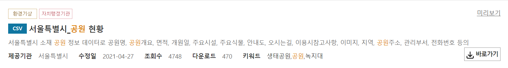

## DB Browser 사용법

[공공 데이터](https://www.data.go.kr/index.do)

#### 공공 데이터포털 데이터 목록 첫페이지

- JSON 파일도 함께 있는 경우도 있지만 대부분이 CSV 파일로 데이터가 저장되어 있다.

#### 프로젝트 예시 산책 메이트

- 산책 메이트 프로젝트를 예시로 들었을 때 전국에 있는 공원 데이터를 가져오기에는 너무 크고, 방대해서 인구가 제일많은 서울 공원 데이터만 가져오는 상황

#### ❓CSV파일을 어떻게 DB에 넣을 수 있을까??

[DB browser 다운로드](https://sqlitebrowser.org/dl/)

DB Browser를 이용해 사용하고자하는 DB에 데이터 넣기

1. 실행하고 데이터베이스 열기 클릭

2. 사용하는 데이터베이스를 열기

3. 사용하고 있는 테이블들을 DB browser에서도 동일하게 확인할 수 있다.

   

4. DB에 넣고 싶은 .csv파일을 가져온다.

5. 실제 사용하는 테이블명과 DB browser 테이블 명을 같게 작성해준다.

6. 확인을 누르고 X 표시를 누르고 저장하기를 하면 내가 사용하고 있는 데이터베이스에 넣기 완료!