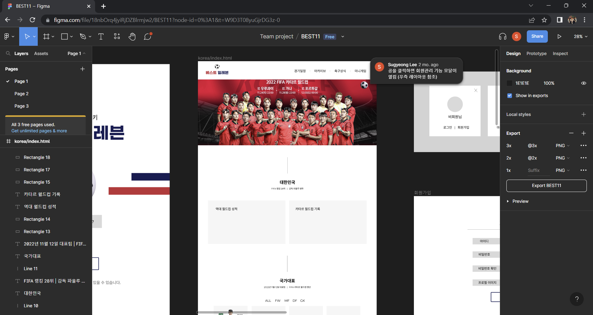
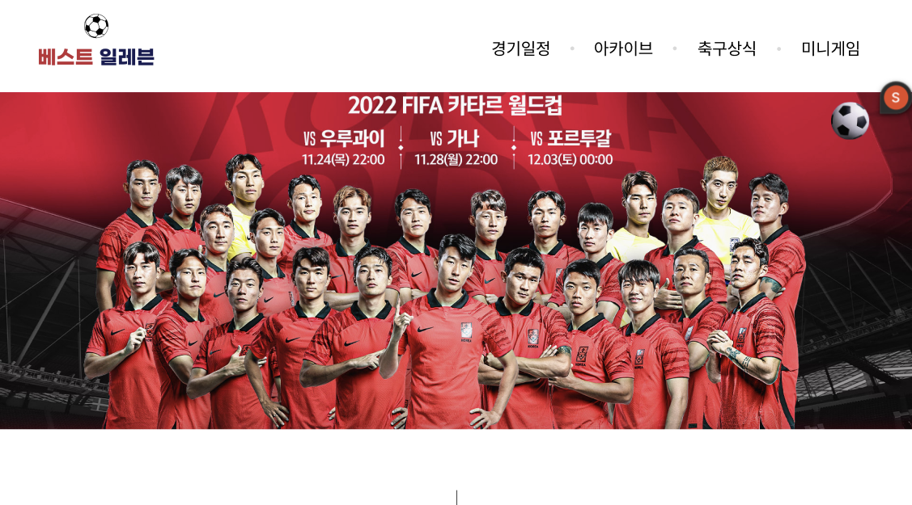
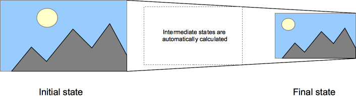

# ✅ [FE] 메인화면 구현

> 🔗소스코드 : Best11/korea/templates/korea/index.html
>
> 1.  Figma 활용하여 화면설계
> 2.  Figma 참조하여 실제 메인화면 구현
>     1.  서비스 인트로 영상 혹은 사진
>     2.  대한민국 월드컵 출전 정보
>     3.  실시간 인기 선수 목록
>     4.  전체 국가대표 선수 목록


## 1. Figma 활용하여 화면설계

> 메인화면은 아래와 같이 4가지 정보를 전달한다.
>
> (1) 서비스 인트로 영상 혹은 사진
>
> (2) 대한민국 월드컵 출전 정보
>
> (3) 실시간 인기 선수 목록
>
> (4) 전체 국가대표 선수 목록



💡 특이사항 : 4개의 영역 사이사이에 **세로선**을 한줄씩 배치하여 사용자가 스크롤을 내릴 때마다 새로운 컨텐츠가 나타난다는 것을 시각적으로 표현 (스크롤 유도)


## 2. Figma 참조하여 실제 메인화면 구현


#### 2-1. 서비스 인트로 영상 혹은 사진

##### 2-1-1. 사용자에게 전달할 정보

- 서비스 전체를 요약할 수 있는 영상 혹은 사진

- 특히 2022년 카타르 월드컵 국가대표와 관련된 컨텐츠 필요

##### 2-1-2. 화면구현

- Figma 설계안



- 실제 구현된 화면


- 소스코드

> 1. 초창기 베타 서비스를 배포할 당시에는 <video> 태그를 활용해서 .mp4 형식의 파일을 첨부했지만, 이런 경우 모바일 환경에서 메인화면에 접속할 때마다 비디오 재생을 위한 새탭이 자꾸 뜨는 불편사항이 발생했기 때문에  태그를 활용하여 .gif 형식의 파일을 첨부하는 방향으로 화면구현 방향을 전환
> 2. PC환경에서 볼 때 첨부하려는 인트로 영상의 가로 길이가 브라우저 전체화면 가로 길이보다 훨씬 짧았기 때문에 영상 집중도를 높이려면 여백 공간에 검정색 배경 처리가 필요했음. 따라서  태그를 감싸는 <div> 에 video-box 클래스를 주고 `background-color: #000000;` 처리. 화면 크기가 작아지면서 검정색 배경이 사라질 때는 부드러운 화면 전환이 일어나야하기 때문에 `transition: all 0.3s ease-out;` 처리
> 3. CSS 미디어쿼리를 활용하여 반응형 화면을 설계. 화면 크기가 큰 상태였을 때는 영상의 가로 길이가 충분히 나타나는 한편, 영상의 세로 길이는 짤림없이 모두 나타나야 하므로  태그에 video 클래스를 주고 `width: auto; height: 40rem;` 처리. 화면 크기가 작아졌을 때는 세로 길이가 더 긴 모바일 환경을 고려한 것으로, 영상의 가로 길이가 주어진 화면에 가득차야 하기 때문에  태그에 video 클래스를 주고 `width: 100%; height: auto;` 처리

```html
<!-- Best11/korea/templates/korea/index.html -->

<!-- 인트로 영상 시작 -->
    <div class="video-box">
        
    </div>
<!-- 인트로 영상 끝 -->
```

```css
/* Best11/static/css/style.css */

/* 동영상 큰 화면 */
@media only screen and (min-width: 800px) {
  .video-box {
    width: 100%;
    height: 50rem;
    overflow: hidden;
    display: flex;
    justify-content: center;
    align-items: center;
    background-color: #000000;
    transition: all 0.3s ease-out;
  }
  .video {
    width: auto;
    height: 40rem;
  }
}

/* 동영상 작은 화면 */
@media only screen and (max-width: 800px) {
  .video-box {
    width: 100%;
    height: auto;
    transition: all 0.3s ease-out;
  }
  .video {
    width: 100%;
    height: auto;
  }
}
```


##### 2-1-3. CSS 미디어쿼리(Media Query) [(link)](https://developer.mozilla.org/en-US/docs/Web/CSS/Media_Queries/Using_media_queries)

- 미디어쿼리란?
  - Media queries allow you to apply CSS styles depending on a device's general type (such as print vs. screen) or other characteristics such as screen resolution or browser viewport width.
  - 미디어 쿼리는 디바이스의 유형(출력물, 화면)이나 디바이스의 특징(화면 해상도, 브라우저 뷰포트 넓이)**에 맞게 CSS 스타일을 적용하고 싶을 때** 활용할 수 있음

- 미디어유형(Media types)

  - `all` : **모든 디바이스**에 특정 CSS 스타일을 적용할 때 적합
  - `print` : **인쇄물, 출력물**에 특정 CSS 스타일을 적용할 때 적합
  - `screen` : **화면**에 특정 CSS 스타일을 적용할 때 적합

- 복잡한 논리 구조의 미디어쿼리

  - `and`, `not`, `only` 활용하여 다수의 유형과 기능을 조합
    - `only` 키워드는 미디어쿼리가 지원되는 브라우저에서만 작동
    - 크롬에서는 `only screen` 과 `screen` 사이에 결과적인 차이가 없음
    - 큰 화면 스타일링 : `@media (min-width: 800px)`
    - 작은 화면 스타일링 : `@media (max-width: 800px)`

  ```css
  /* 동영상 큰 화면 */
  @media only screen and (min-width: 800px) { ... }
  
  /* 동영상 작은 화면 */
  @media only screen and (max-width: 800px) { ... }
  ```

  

##### 2-1-4. CSS 트랜지션(`transition`) [(link)](https://developer.mozilla.org/en-US/docs/Web/CSS/CSS_Transitions/Using_CSS_transitions)

- 트랜지션이란?

  - CSS transitions provide a way to control animation speed when changing CSS properties.
  - CSS 트랜지션은 어떤 요소의 처음 상태(Initial state)와 마지막 상태(Final State) 사이 CSS 속성에 변화를 주려고 할 때, **애니메이션 속도를 조절**할 수 있게 도와줌

  

- transition-timing-function 속성값

  > 트랜지션 효과의 시간당 속도를 설정하는 것

  - `linear` : 트랜지션이 처음부터 끝까지 일정한 속도로 진행
  - `ease` : 디폴트값. 트랜지션이 천천히 시작되지만, 점차 빨라지다가 마지막에 다시 느려짐
  - `ease-in` : 트랜지션이 천천히 시작됨
  - `ease-out` : 트랜지션이 천천히 끝남 **(← 실제 프로젝트에 적용한 효과)**
  - `ease-in-out` : 트랜지션이 천천히 시작되고 천천히 끝남

- 예시 코드

  > 적용된 효과는 [MDN](https://developer.mozilla.org/en-US/docs/Web/CSS/CSS_Transitions/Using_CSS_transitions) 및 [프로젝트 메인화면](http://best11kdt-env.eba-m22kfyhv.ap-northeast-2.elasticbeanstalk.com/korea/) 참조

  ```css
  nav {
    display: flex;
    gap: 0.5rem;
  }
  
  a {
    flex: 1;
    background-color: #333;
    color: #fff;
    border: 1px solid;
    padding: 0.5rem;
    text-align: center;
    text-decoration: none;
    transition: all 0.5s ease-out;
  }
  
  a:hover,
  a:focus {
    background-color: #fff;
    color: #333;
  }
  ```

  ```css
  @media only screen and (min-width: 800px) {
    .video-box {
      width: 100%;
      height: 50rem;
      overflow: hidden;
      display: flex;
      justify-content: center;
      align-items: center;
      background-color: #000000;
      transition: all 0.3s ease-out;
    }
    .video {
      width: auto;
      height: 40rem;
    }
  }
  ```


#### 2-2. 대한민국 월드컵 출전 정보

##### 2-2-1. 사용자에게 전달할 정보

- FIFA 랭킹
- 현재 국대 감독
- 역대 성적
- 2022년 월드컵 경기 기록

##### 2-2-2. 화면구현

- Figma 설계안

- 실제 구현된 화면
- 소스코드


#### 2-3. 실시간 인기 선수 목록

##### 2-3-1. 사용자에게 전달할 정보

- [응원하기] 누적 합계가 가장 많은 11명의 선수들

##### 2-3-2. 화면구현

- Figma 설계안

- 실제 구현된 화면
- 소스코드


#### 2-4. 전체 국가대표 선수 목록

##### 2-4-1. 사용자에게 전달할 정보

- 2022년 월드컵 선발 국가대표 선수 목록
- 사용자가 원하는 선수를 빠르게 찾을 수 있도록 포지션 별 분류 탭 필요

##### 2-4-2. 화면구현

- Figma 설계안

- 실제 구현된 화면
- 소스코드