# ✅ [배포] AWS MFA 활성화

> 1. AWS MFA 란?
> 2. AWS MFA 설정하기

***"프리티어로 서비스는 배포해봤는데, AWS 계정이 해킹 당할까봐 불안하다면?"***

---------------- *AWS MFA를 설정합시다*

## 1. AWS MFA 란?

> 사용자가 AWS 웹사이트나 서비스에 접근하려고 할 때, AWS는 일반적인 로그인 방식으로 사용자의 신원을 증명할 뿐만 아니라 MFA 메커니즘의 특별한 인증을 추가로 요구하여 보안을 강화함
>
> *"MFA adds extra security because it requires users to provide unique authentication from an AWS supported MFA mechanism in addition to their regular sign-in credentials when they access AWS websites or services"*
>
> source : [AWS User Guide](https://docs.aws.amazon.com/IAM/latest/UserGuide/id_credentials_mfa.html)

- MFA 메커니즘 (source : [NAVER 개인정보보호 블로그](https://m.blog.naver.com/n_privacy/221131898198))
  - Multi-Factor Authentication
  - 2개 이상의 수단(인증 팩터, Authentication Factor)으로 사용자의 신원을 증명하는 방식
  - 현재까지는 2가지 팩터를 사용하는 경우가 많아 **투팩터 인증(2 Factor Authentication, 2FA)** 이 많이 알려져 있음

- 프리티어(Free tier)로 AWS 서비스를 이용하고 있더라도, 계정이 해킹 당하는 경우 과도한 요금을 청구받게 될 수 있으니 AWS MFA 를 꼭 설정해야함

## 2. AWS MFA 설정하기

2-1. AWS 로그인 후, 화면 우측 상단 본인의 계정 이름 - [보안 자격 증명] 클릭

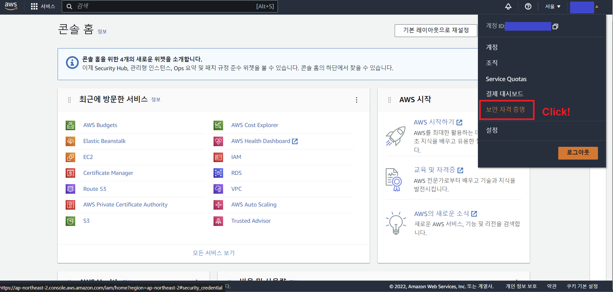

2-2. 본인의 ROOT 계정에 MFA 가 활성화되지 않았음을 확인했다면, [MFA 할당] 클릭

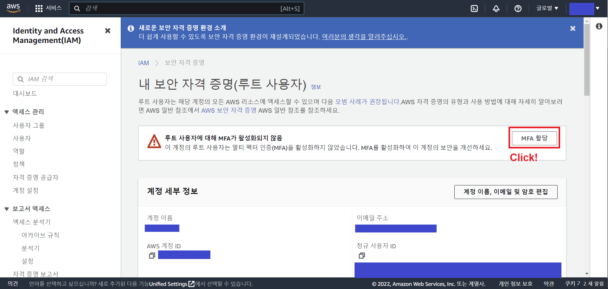

2-3. MFA 디바이스 이름을 자유롭게 입력하고, MFA 디바이스 선택 항목에서 [인증 관리자 앱] 선택

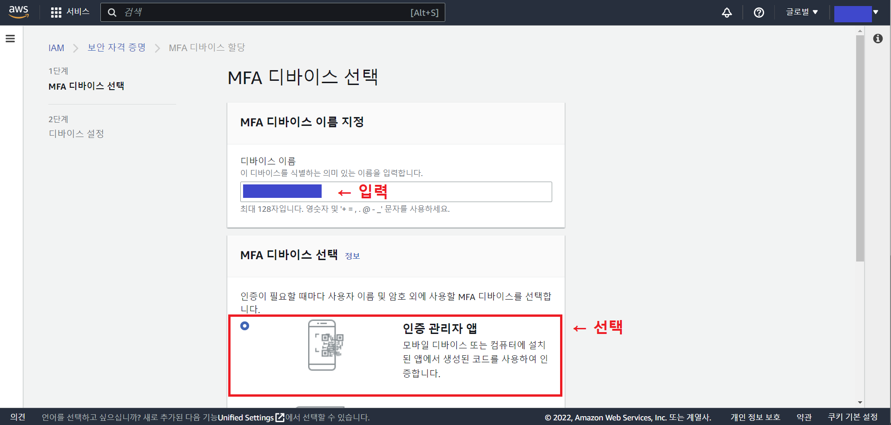

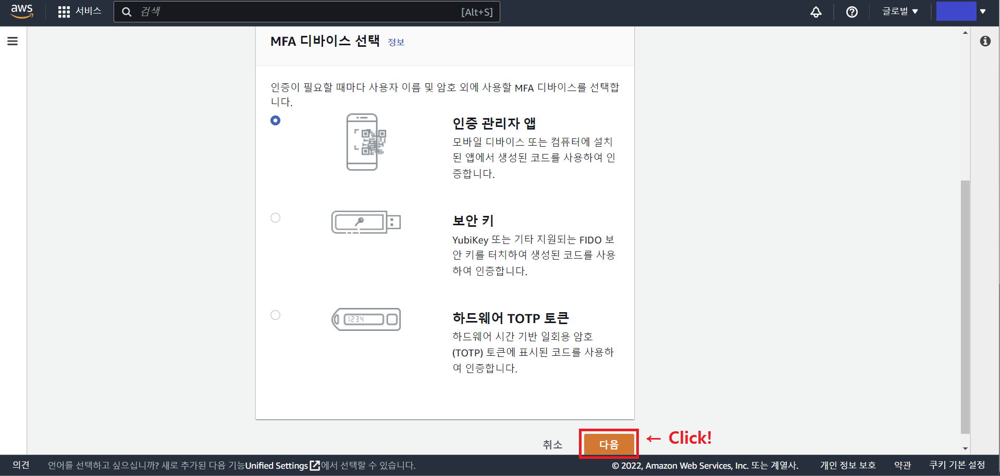

2-4. [호환되는 애플리케이션 목록 참조] 를 클릭하여 본인이 설치해야할 어플리케이션이 무엇인지 확인

- 필자는 iOS 운영체제에 맞는 Google Authenticator 설치

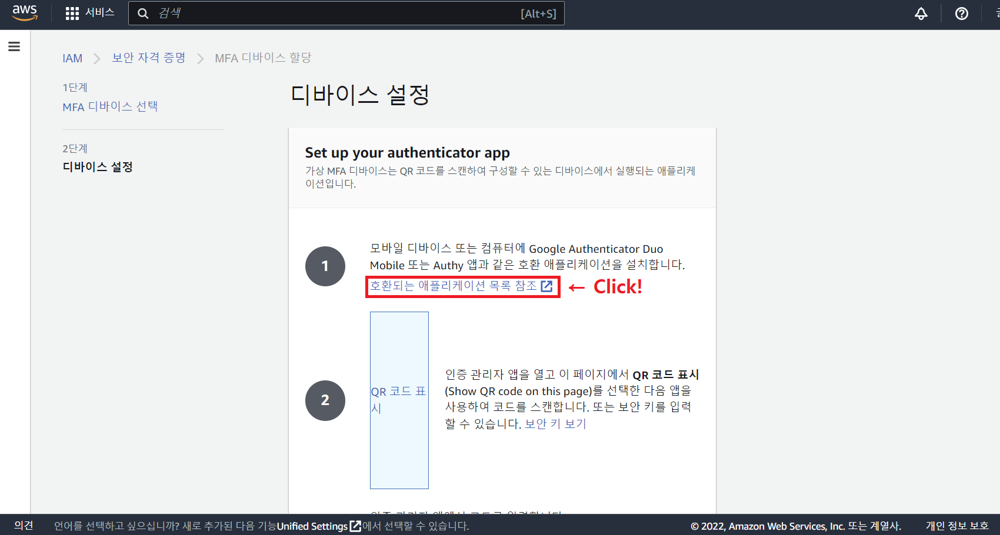

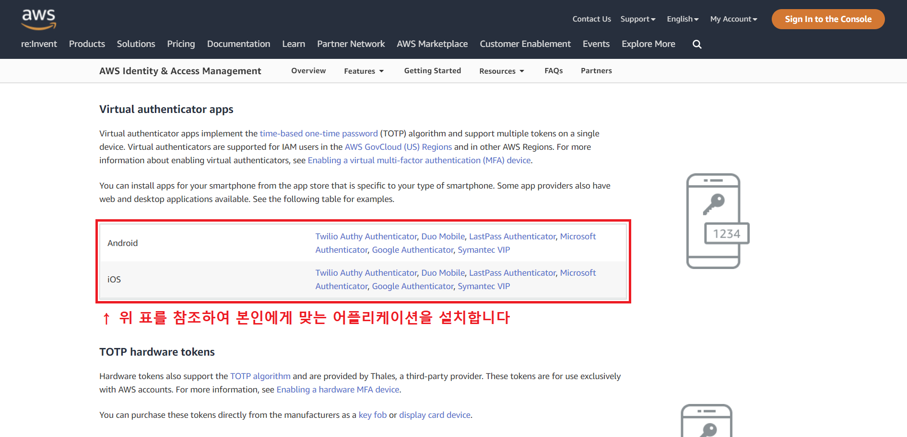

2-5. App Store 에서 Google Authenticator 설치 

- 기존에 SNS 로그인 인증용으로 Duo Mobile 도 잘 사용하고 있었는데, 이번 포스팅을 작성하며 Google Authenticator 도 사용해봄

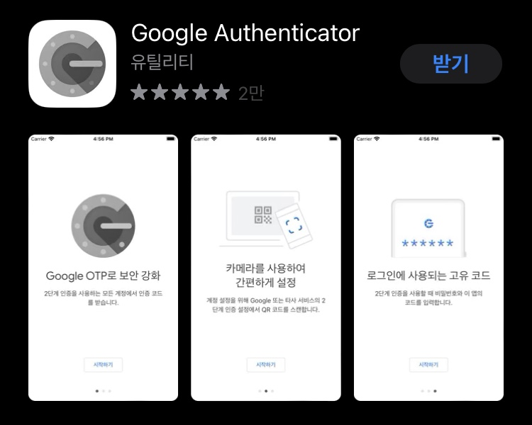

2-6. Google Authenticator 설치완료 후, [시작하기] 버튼을 클릭했을 때 나오는 화면

- AWS 화면에서 MFA 설정과 관련된 QR 코드를 받아와야 하므로, [QR 코드 스캔]을 미리 클릭

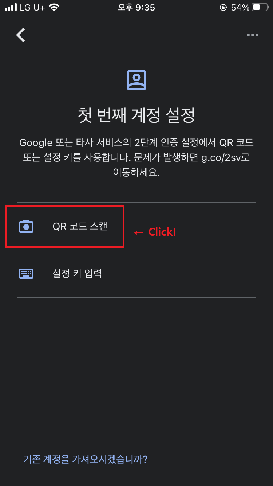

2-7. 디바이스 설정을 진행하고 있던 AWS 화면에서 [QR 코드 표시] 클릭

- [QR 코드 표시] 클릭 시, AWS 에서 MFA 설정과 관련된 QR 코드를 생성해주고, Google Authenticator 앱에 해당 QR 코드를 인식시킴
- AWS [QR 코드 표시] 하단에 [MFA 코드 1], [MFA 코드 2]가 있는데
  - [MFA 코드 1] 는 **QR 코드 스캔 직후 뜨는 6자리 숫자**를 입력
  - [MFA 코드 2] 는 **20초 후에 새로 뜨는 6자리 숫자**를 입력

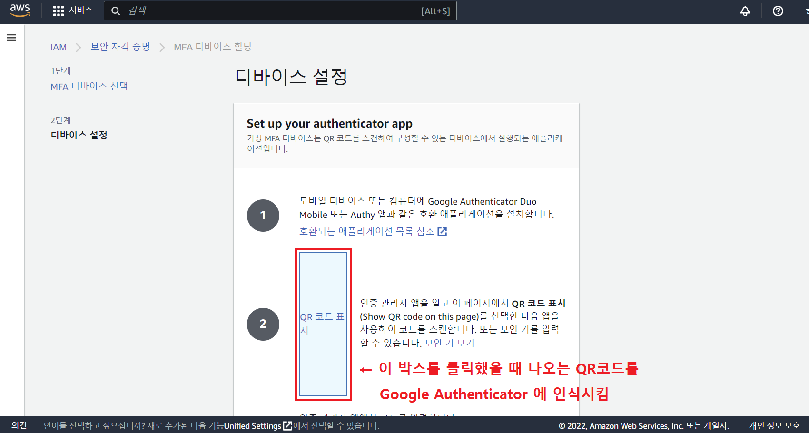

2-8. MFA 할당 완료

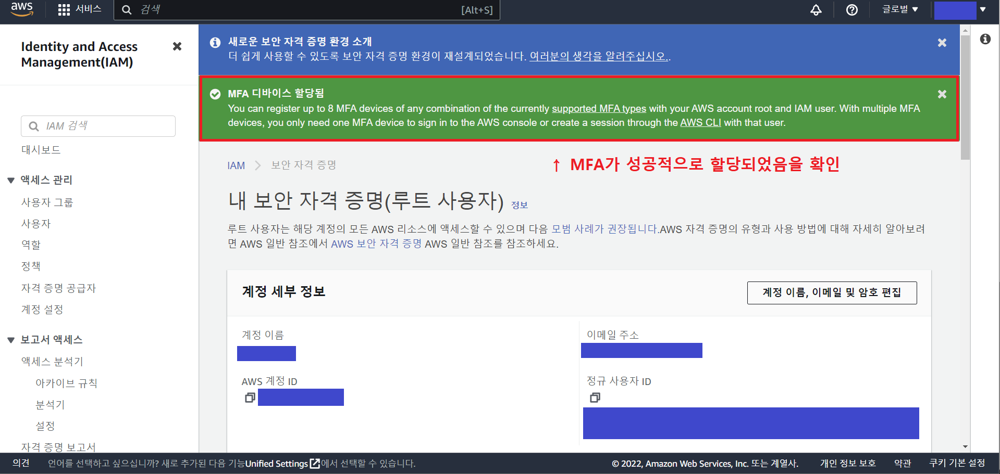

2-9. MFA 할당 이후, AWS 에 루트 사용자로 로그인할 때마다 MFA 코드를 인증하게끔 바뀌어있음

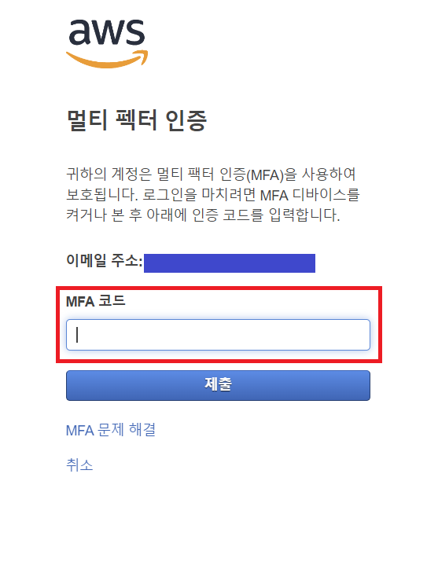