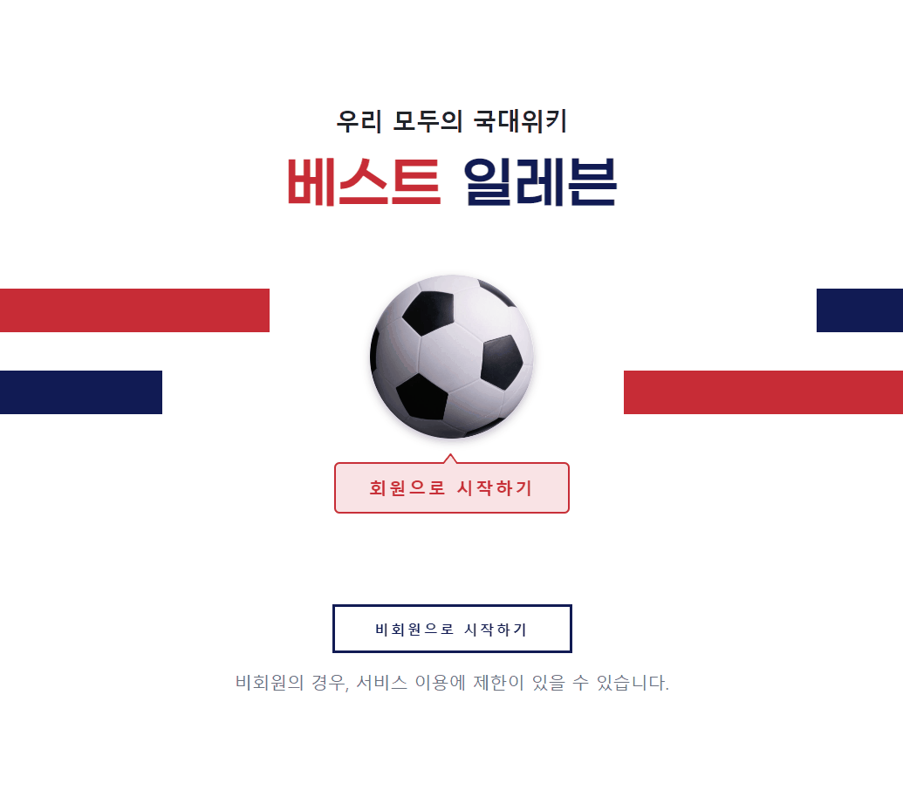

# 위로가기 버튼


html

```html
<!-- Top Button -->
<div class="topBtn" style="z-index: 2;">
  <button id="hexagon" class="text-white fs-4" onclick="topFunction()">
    <svg xmlns="http://www.w3.org/2000/svg" width="20" height="20" fill="currentColor" class="bi bi-chevron-compact-up" viewbox="0 0 16 16">
      <path fill-rule="evenodd" d="M7.776 5.553a.5.5 0 0 1 .448 0l6 3a.5.5 0 1 1-.448.894L8 6.56 2.224 9.447a.5.5 0 1 1-.448-.894l6-3z"/>
    </svg>
    <div>
      위로
    </div>
  </button>
</div>
```


css

```css
/* base.html - Top 버튼 */
.topBtn {
  position: fixed;
  bottom: 8rem;
  right: 8%;
  opacity: 0.7;
}
.topBtn:hover {
  opacity: 0.9;
}

#hexagon {
  background-color: #111b54;
  height: 6rem;
  width: 6.5rem;
  clip-path: polygon(50% 0%, 100% 38%, 82% 100%, 18% 100%, 0% 38%);
}
```


javascript

```javascript
// Top Button

  // get the button
  let myBtn = document.getElementById("hexagon")

  // When the user scrolls down 650px from the top of the document, show the button
  window.onscroll = function () {
    scrollFunction();
  };

  function scrollFunction() {
    if (document.body.scrollTop > 650 || document.documentElement.scrollTop > 650) {
      myBtn.style.display = "block";
    } else {
      myBtn.style.display = "none";
    }
  }

  // When the user clicks on the button, scroll to the top of the document
  function topFunction() {
    document.body.scrollTop = 0; // for Safari
    document.documentElement.scrollTop = 0; // for Chrome, Firefox, IE, and Opera
  }
```


# 메인페이지



### 축구공

html

```html
<a href="">
  
</a>
```


css

```css
.main-ball {
  width: 15rem;
  border-radius: 70%;
  transition: all ease 1s;
  box-shadow: rgba(0, 0, 0, 0.24) 0px 3px 8px;
}
.main-ball:hover {
  transform: rotate(360deg); /* 회전 */ 
}
```


### 툴팁 모양 (회원으로 시작하기)

html

```html
<div class="main-tooltip bounce">회원으로 시작하기</div>
```


css

```css
.main-tooltip {
  background-color: #fae4e6;
  border: #c82d36 solid 1.8px;
  border-radius: 0.5rem;
  color: #c82d36;
  font-size: 1.6rem;
  font-weight: 600;
  height: auto;
  letter-spacing: 0.2rem;
  margin-top: 2.5rem;
  margin-bottom: 5rem;
  padding: 1rem 3rem;
  position: relative;
  width: fit-content;
  z-index: 100;
}
.main-tooltip::after {
  border-color: #fae4e6 transparent;
  border-style: solid;
  border-width: 0 6px 8px 6.5px;
  content: "";
  display: block;
  left: 9.8rem;
  position: absolute;
  top: -7px;
  width: 0;
  z-index: 1;
}
.main-tooltip::before {
  border-color: #c82d36 transparent;
  border-style: solid;
  border-width: 0 6px 8px 6.5px;
  content: "";
  display: block;
  left: 9.8rem;
  position: absolute;
  top: -9.5px;
  width: 0;
  z-index: 0;
}

.bounce {
  animation: bounce 2s ease infinite;
}

@keyframes bounce {
  0%,
  20%,
  50%,
  80%,
  100% {
    transform: translateY(0);
  }
  40% {
    transform: translateY(-8px);
  }
  60% {
    transform: translateY(-5px);
  }
}
```


# 기타 지식

- `a 태그` 새 창/새 탭으로 열기

  ```html
  <!-- 깃헙프로필 -->
  <a href="https://github.com/JeongJinGan" target="_blank" class="">
    <button class="btn border-0 p-0">
      
      <p class="pt-2 mb-0">간정진</p>
    </button>
  </a>
  ```

  > a 태그 내에 `target="_blank"`를 추가하면 새 창 또는 새 탭으로 링크가 열린다.
  >
  > 현재 html 문법으로는 새 창과 새 탭을 구분지을 수는 없다. 이 기능은 브라우저 환경에 따라 새 창 또는 새 탭으로 열리게 되지만 대부분 새 탭으로 열린다.

