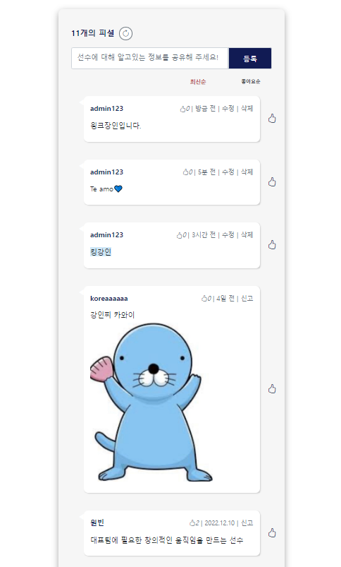

# ☑ 작성일 표기 형식 변경

[참고블로그](https://parkhyeonchae.github.io/2020/05/09/django-project-28/)

> 피셜 작성일을 `property`를 사용해 `방금 전`, `n분 전`, `n시간 전`, `n일 전`으로 표시하기





korea/models.py

```python
from datetime import datetime, timedelta

class Comment(models.Model):
    players = models.ForeignKey(
        Players, on_delete=models.CASCADE
    )  # 선수를 ForeignKey로 불러온다.
    user = models.ForeignKey(settings.AUTH_USER_MODEL, on_delete=models.CASCADE)
    content = models.TextField()
    like_users = models.ManyToManyField(
        settings.AUTH_USER_MODEL, related_name="like_comments"
    )
    created_at = models.DateTimeField(auto_now_add=True)
    updated_at = models.DateTimeField(auto_now=True)

    # 함수 추가
    @property
    def created_string(self):
        # time 변수에 작성 경과 시간 저장 (현재시간 - 작성시간)
        time = datetime.now(tz=timezone.utc) - self.created_at

        if time < timedelta(minutes=1):
            return "방금 전"
        elif time < timedelta(hours=1):
            return str(int(time.seconds / 60)) + "분 전"
        elif time < timedelta(days=1):
            return str(int(time.seconds / 3600)) + '시간 전'
        elif time < timedelta(days=7):
            time = datetime.now(tz=timezone.utc).date() - self.created_at.date()
            return str(time.days) + "일 전"
        else:
            return False
```

> - `class Comment` 내부에 파이썬의 `property` decoratoer를 사용하여 `created_string` 함수를 추가한다.
> - `property` decoratoer를 사용하면 함수가 아닌 멤버변수와 같은 형식으로 접근 할 수 있다.
> - `@property`를 사용함으로써 외부에서 클래스 내부 변수를 참조 할 수 있다.


> - `created_string` 함수를 살펴보면 `time` 변수에 현재시간에서 작성시간을 뺀 작성 경과 시간을 저장한다.
> - 그 후 `timedelta` 메소드를 사용하여 분, 시간, 일 단위로 표시되게 하며 7일이 지날 경우 false를 반환하여 템플릿에서 원래의 Date형식(Y.m.d)으로 표시되게 구현한다.


detail_player.html

```django
<!-- 작성/수정시간 -->

<!-- 수정된 글이 아니면 -->

  
    {{ comment.created_at|date:'Y.m.d' }}
  
    {{ comment.created_string }}
  
<!-- 글이 수정된 경우 -->

  
    {{ comment.updated_at|date:'Y.m.d' }}
  
    {{ comment.created_string }}
  
    (수정됨)

```

> `@property`를 사용했기 때문에 comment.created_string()이 아닌 `comment.created_string`의 형식으로 함수를 호출할 수 있다.

[property에 대한 추가 설명](https://hamait.tistory.com/827)


❓ 아래 `profile_image` 함수도 propery를 사용할 수 있지 않을까?

korea/models.py

```python
class Players(models.Model):
    name = models.CharField(max_length=7)
    english_name = models.CharField(max_length=20)
    back_number = models.IntegerField()
    birthdate = models.DateField()
    team = models.CharField(max_length=20)
    player_image = ProcessedImageField(
        upload_to="",
        blank=True,
        processors=[ResizeToFill(200, 200)],
        format="JPEG",
        options={"quality": 80},
    )
    position = models.CharField(max_length=10)
    height = models.IntegerField(default=0)
    weight = models.IntegerField(default=0)
    fans = models.ManyToManyField(
        to=settings.AUTH_USER_MODEL, related_name="like_player"
    )

    def profile_image(self):
        if self.player_image and hasattr(self.player_image, "url"):
            return self.player_image.url
        else:
            return "../static/images/Soccer-Ball.png"
```

⬇ @property 사용하기

```python
@property
def profile_image(self):
    try:
        url = self.player_image.url
    except:
        url = "../static/images/Soccer-Ball.png"
    return url
```

[참고자료](https://hwan-hobby.tistory.com/148)


# ☑ 수정된 글에 '(수정됨)' 표시


korea/models.py

```python
class Comment(models.Model):
    players = models.ForeignKey(
        Players, on_delete=models.CASCADE
    )  # 선수를 ForeignKey로 불러온다.
    user = models.ForeignKey(settings.AUTH_USER_MODEL, on_delete=models.CASCADE)
    content = models.TextField()
    like_users = models.ManyToManyField(
        settings.AUTH_USER_MODEL, related_name="like_comments"
    )
    created_at = models.DateTimeField(auto_now_add=True)
    updated_at = models.DateTimeField(auto_now=True)
    
    # (수정됨) 표시 위한 함수
    @property
    def is_updated(self):
        time = self.updated_at - self.created_at
        if time < timedelta(seconds=10):
            return False
        else:
            return True
```


detail_player.html

```html
<!-- 작성/수정시간 -->

<!-- 수정된 글이 아니면 -->

  
    {{ comment.created_at|date:'Y.m.d' }}
  
    {{ comment.created_string }}
  
<!-- 글이 수정된 경우 -->

  
    {{ comment.updated_at|date:'Y.m.d' }}
  
    {{ comment.created_string }}
  
    (수정됨)

```