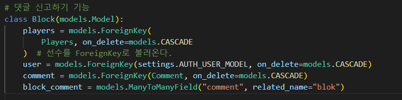
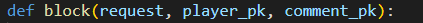
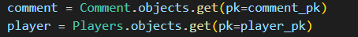
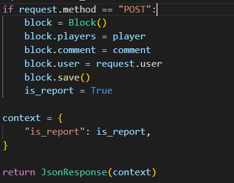
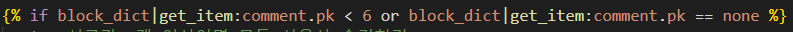
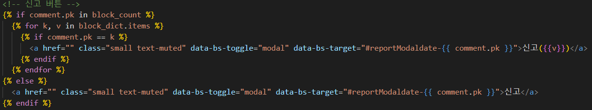
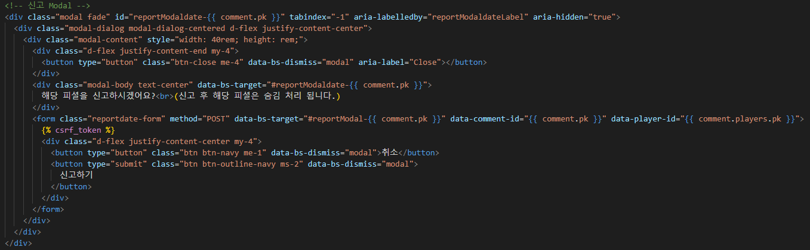
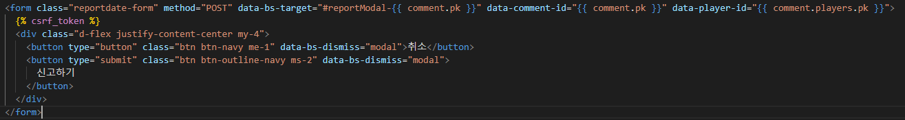

# 신고하기 만들기

> 맘에 안드는 게시글, 피셜(댓글) 등을 신고하는 기능 하나하나 뜯어 보는 시간

- 신고하기 기능 핵심 기능
  - 로그인 후 신고 가능
  - 신고하면 해당 피셜 숨김처리 -> 내 프로필 페이지 확인 및 신고 취소 가능
  - 신고 안한 다른 유저 경우 신고 카운트만 증가
  - 신고 5개 초과(6개 부터) 모든 사용자 숨김처리 되도록 구현
  - 모달 창을 통해 신고 할 경구 안내 문구 노출 후 작동


## 1 . 준비단계

1. 신고된 데이터를 저장하기 위해 모델을 우선 구성 한다.(향 후 모델에 데이터를 할당 해야 한다)

 

- players : 피셜이 각 선수마다 있기 때문에 해당 선수의 PK 값을 저장할 테이블
- user : 내가 어떠한 피셜을 신고했는지 알아야 하기 때문에 나의 pk 값을 저장할 테이블
- comment : 신고한 피셜의 pk 를 저장하기 위한 테이블
- block_comment : 신고한 피셜의 내용을 저장할려고 구성은 했지만 불필요한 테이블......


## 2. 작동하도록 views 작성

1.  신고하기 위한 데이터를 지정해서 가져온다.



2. 각각의 pk값을 통해 신고하려는 데이터의 정보를 새로운 변수에 할당 한다.



3. 신고피셜 모델에 변수를 저장 한다.(현재 코드는 비동기로 수정 안료된 코드이다)



- block : block모델을 지정
- 각 테이블에 player, comment, user 을 입력
- 모델을 저장(save) 한다


## 3. templates 에서 디테일 수정 하기

1. 신고 5개 초과 피셜 숨김처리 if 문틀 통한 분기 처리



- 피셜 카운트가 6보다 작거나 none 일때 안보이도록 설정

2. 피셜의 신고 버튼을 신고 유, 무에 따라서 다르게 표현



3. 모달 창을통해 신고여부 및 신고후 숨김처리 공지



- 모달창의 신고하기 버튼을 form을 통해 비동기로 변경 하기 위해 별도 변경




## 4. 신고하기 비동기 변환

- 비동기란?
  - 버튼(인풋), 아이콘을 클릭 했을 경우 사이트를 새로고침 하지 않고 원하는 데이터를 처리하는 방식으로
    사이트가 움지이지 않고 작동한다고 하여 `비동기`라고 말한다.
  - 다양한 방법으로 구현이 가능 하여 form의 ` submit`타입이나, 버튼, 아이콘 등을 script를 통해 구현 할 수 있다.

___

✅ 신고 유,무 분기 처리 때문에 폼이 두개 존재해서 두가지 폼을 동시에 사용되는 부분 참고.

1. form에 class, id 값 분류 해주기

```html
<form class="report-form" method="POST" data-bs-target="#reportModal-{{ comment.pk }}" 
      data-comment-id="{{ comment.pk }}" data-player-id="{{ comment.players.pk }}">
  
  <div class="d-flex justify-content-center my-4">
    <button type="button" class="btn btn-navy me-1" data-bs-dismiss="modal">취소</button>
    <button type="submit" class="btn btn-outline-navy ms-2" data-bs-dismiss="modal">
        신고하기</button>
  </div>
</form>
```


- form 의 __class__를 지정 script에서 선택해서 사용 예정
- data-**-id 를 지정, __comment__와 __player__의 pk로 해당 피셜을 구분 할 수 있도록 작성
- 신고하기 버튼의 type를 __submit__으로 설정 form 의 넘겨주는 값을 통해 비동기 처리 진행


__<script 코드>__

```html
<!-- 신고하기 스크립트 -->
  <script>
    const reportForm = document.querySelectorAll(".report-form")
    const reportdateForm = document.querySelectorAll(".reportdate-form")
    const csrftoken_report = document
      .querySelector('[name=csrfmiddlewaretoken]')
      .value

      reportForm
      .forEach((form) => {
        form.addEventListener('submit', function (event) {
          event.preventDefault()
          const playerId = event.target.dataset.playerId
          const commentId = event
            .target
            .dataset
            .commentId

            axios({
              method: 'post',
              url: `/korea/detail/${playerId}/${commentId}/block/`,
              headers: {
                'X-CSRFToken': csrftoken_report
              }
            })
            .then((response) => {
              const isReport = response.data.is_report
              const reportDiv = document.querySelector(`#report-${commentId}`)
              if (isReport === true) {
                reportDiv
                  .classList
                  .add('form-hidden')
              }
            })
            .catch((error) => {
              console.log(error.response)
            })
          })
      })

    reportdateForm.forEach((form) => {
      form.addEventListener('submit', function (event) {
        event.preventDefault()
        const playerId = event.target.dataset.playerId
        const commentId = event
          .target
          .dataset
          .commentId

          axios({
            method: 'post',
            url: `/korea/detail/${playerId}/${commentId}/block/`,
            headers: {
              'X-CSRFToken': csrftoken_report
            }
          })
          .then((response) => {
            const isReport = response.data.is_report
            const reportDiv = document.querySelector(`#reportdate-${commentId}`)
            if (isReport === true) {
              reportDiv
                .classList
                .add('form-hidden')
            }
          })
          .catch((error) => {
            console.log(error.response)
          })
        })
    })
  </script>
```

